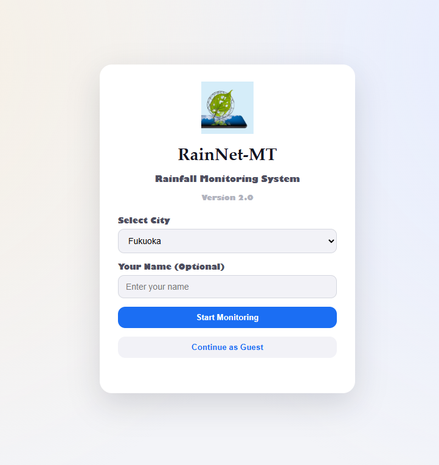
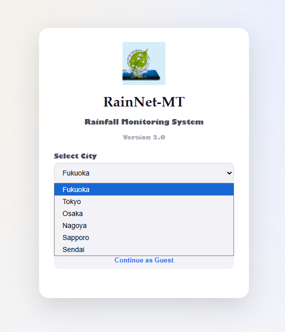
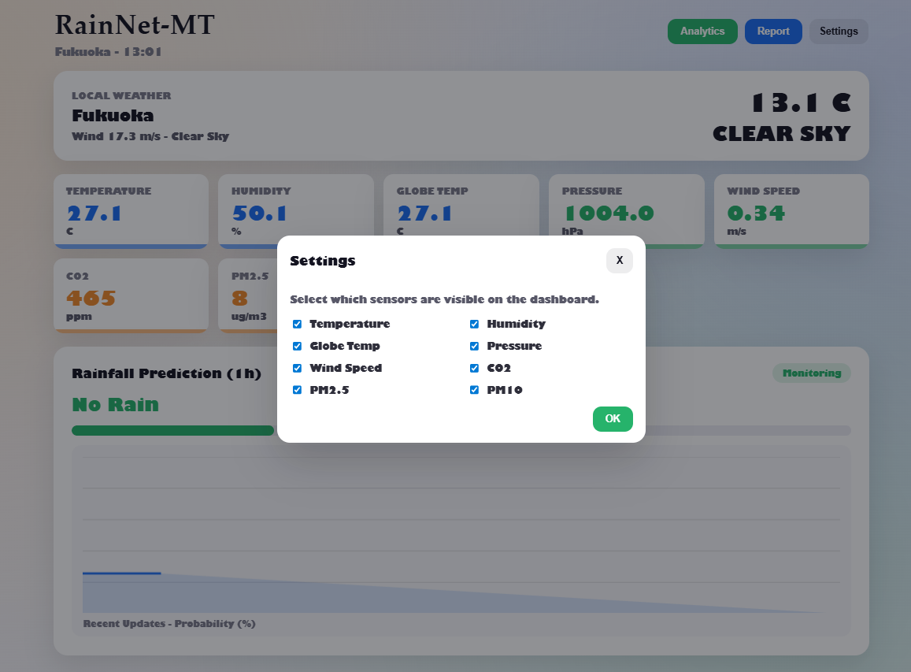

# RainNet-MT Web アプリ

RainNet-MT のデスクトップ版（`Main.py`）と同じ構成・データ源を前提にした Web ダッシュボードです。  
MQTT のリアルタイムデータ、MySQL の最新値・履歴、天気 API を統合して表示します。


## 主な機能

- センサー値（温度・湿度・気圧・風速・CO2・PM2.5・PM10・グローブ温度）の可視化  
  ※ 本プロジェクトは実機のセンサー端末を持っている前提で MQTT を使用しています
- 降雨予測（RainNet-MT の推論結果に基づく確率・ラベル）
- 天気情報（Open-Meteo の current weather）
- 都市選択付きログイン画面




## フォルダ構成

- `index.html` / `styles.css` / `app.js` : フロントエンド
- `server.py` : API サーバ（MQTT・MySQL・天気）
- `Image/` : README 用スクリーンショット
- `favicon.ico` / `AppIcon.png` : アイコン

## 起動方法

```bash
python server.py
```

起動後、ブラウザで以下にアクセスします。  
`http://localhost:8000/`

## 使い方

1) `http://localhost:8000/login.html` にアクセス  
2) 都市を選択し、ユーザー名を入力（任意）  
3) 「Start Monitoring」または「Continue as Guest」で開始



## データ取得の流れ

- MQTT:マイコンハードウェアからセンサー値を受信（実機がある場合）
- MySQL: 最新値と 24 時間の履歴を取得
- 天気: Open-Meteo から現在の天気を取得

MQTT データが一定時間届かない場合は、MySQL の最新値で補完します。
MySQL も利用できない場合は、画面表示のみ確認できるよう空データとして描画されます。

## MQTT について

本プロジェクトの MQTT センサー連携は、私が用意したハードウェア端末を前提にしています。  
同じ構成で再現したい場合は、各自で MQTT を送信するセンサー端末を準備してください。

センサー端末がない場合は、以下の機能だけでも利用できます。

- RainNet-MT の推論（モデルが用意できる場合）
- リアルタイム天気取得（Open-Meteo）

## API エンドポイント

- `GET /api/state`  
  最新センサー値、予測、天気、履歴（最新 30 件）
- `GET /api/history?label=Ta`  
  指定センサーの 24 時間履歴

## 注意事項

- MQTT の証明書 `emqxsl-ca.crt` が必要です。
- MySQL の接続情報は `server.py` で設定します。
- 推論モデルを使う場合は `RAINNET_MODEL` と `RAINNET_SCALER` の環境変数を設定してください。
